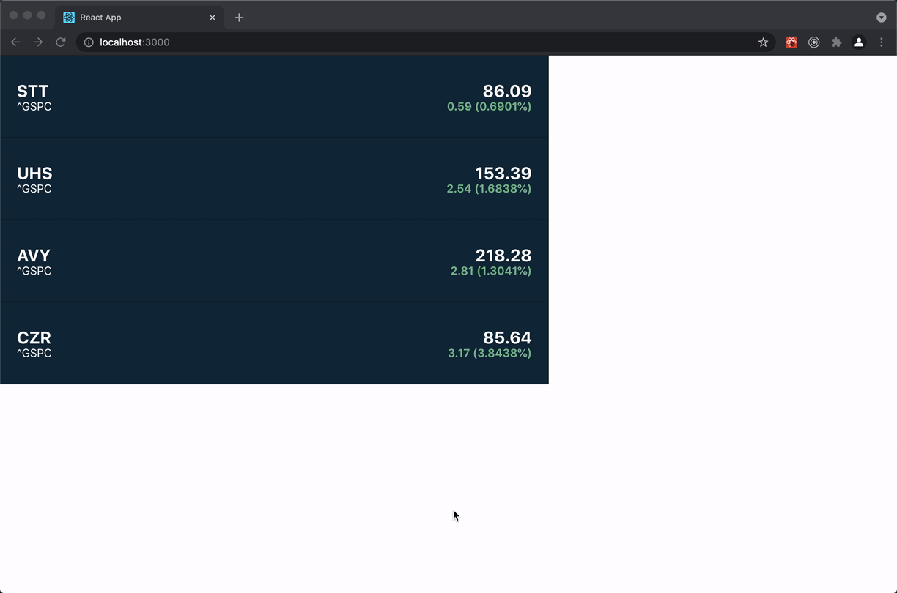

## Stocks Ticker by Rodrigo Solís


### Set up credentials
This app uses finnhub to retrieve the stocks data, in order to be able to run the app you need to [create an account](https://finnhub.io/register) and [retrieve the API key](https://finnhub.io/dashboard).
Once you have the API key make sure to add it to the application by duplicating the `.env` file as `.env.local` and setting the value of `REACT_APP_FINNHUB_KEY`.

### How to run
Please make sure you install the dependencies running:
```
yarn install
```

Once this finish you can run it using the following command:
```
yarn start
```

### Design inspiration
In order to create this widget I inspired myself in the following designs:

- [Stock Widget by Anthony Nguyen](https://dribbble.com/shots/2291008-Stock-Widget)
- [Cryptocurrency Tracker/Ticker by Glen Baku](https://dribbble.com/shots/3673913-Cryptocurrency-Tracker-Ticker)

For the animation, I blatantly copied [the implementation from react-spring examples](https://codesandbox.io/s/49jsc).

